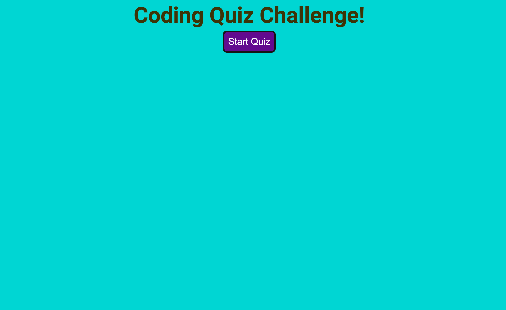
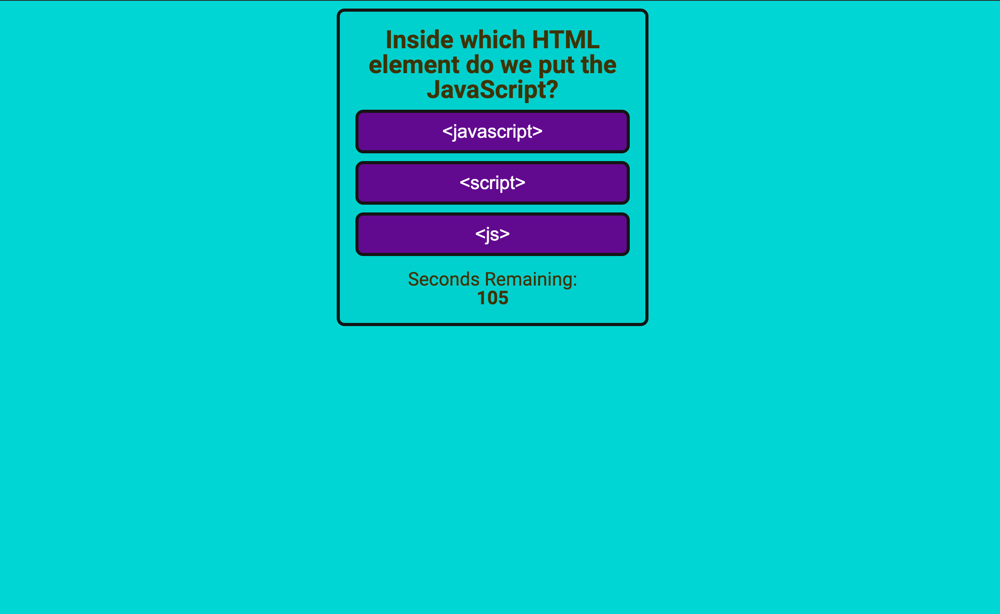
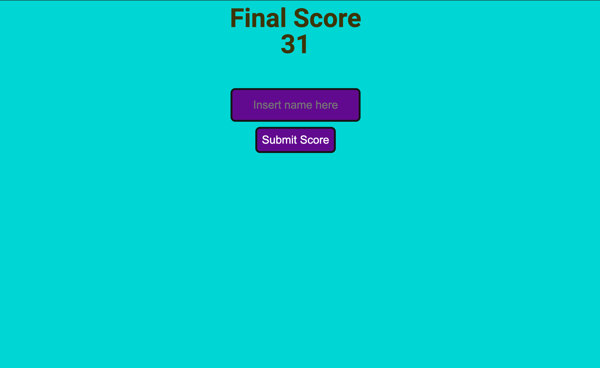
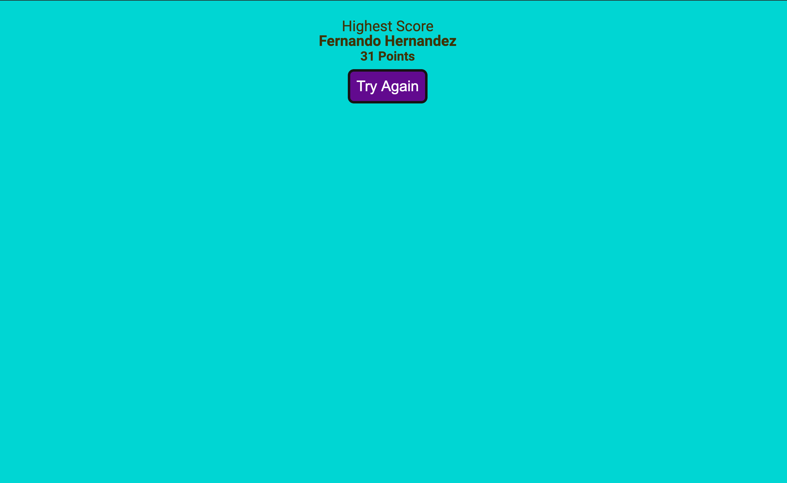
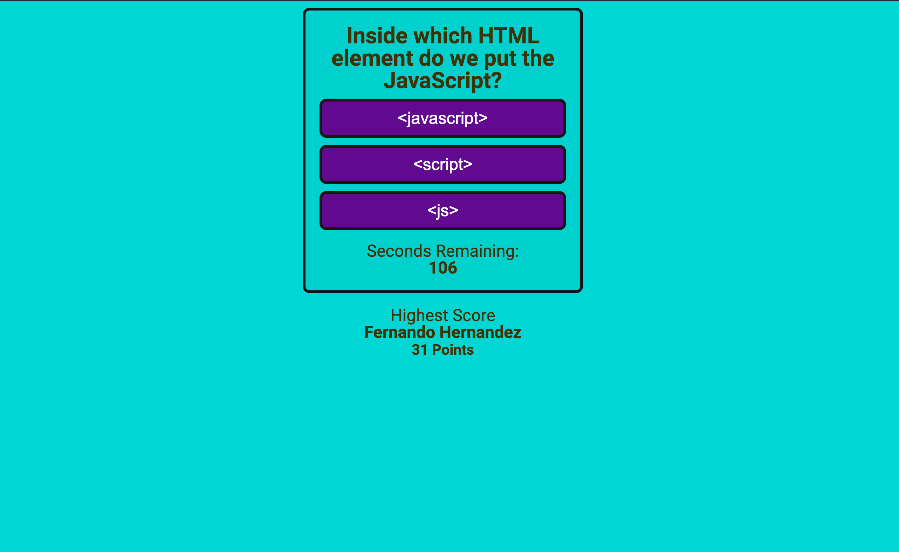

# Code Quiz

This Code quiz will test your general knowledge about Javascript.
[link to deployed app](https://proudfer000.github.io/codeQuiz/)

## Usage

**When** click **Start Button** the timer will start and you will be presented with the a question and 3 possible answer.

**IF** question its answered right you will get points ~5 points else you will lose **3 seconds**.

**When** the Quiz its finished or you run out of time you will be presented with the **option** to submit your score and name then you can try again, but this time if you don't beat the older Hight score you wont be prompted with the option to save your score and name instead you will be prompted with the option to **try again**.

Highest Score will only show up when theres actually a score to show.

### Hope you Enjoy it!!!
